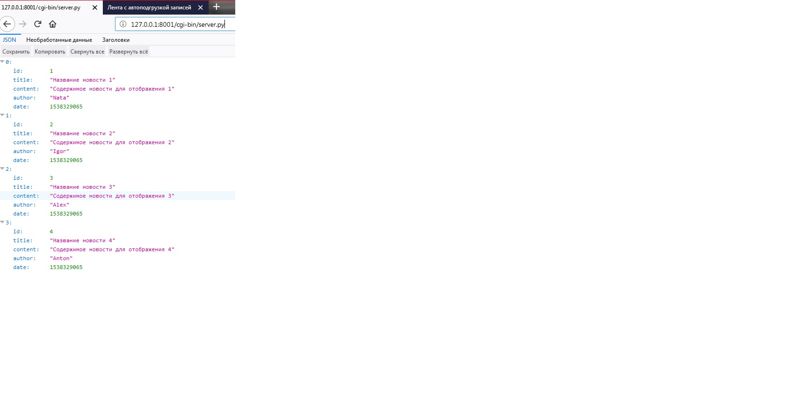

# autolist

# Лента автоподгрузки записей на JS + Python
Может быть использована при получении данных с сервера небольшими порциями.
Библиотека содержит 2 режима работы:
- Получение данных посредством кнопки на странице
- Получение данных автоматически при прокрутке страницы
Библиотека может быть использована при создании ленты новостей, небольшой социальной сети, а также для отображения любых данных на странице, получаемых с веб-сервера.

## Соединение с БД
Данные для соединения с базой данных MySQL:
```html
- Логин: autolist_local
- Пароль: autolist_local
- База данных: autolist_local
- Host: localhost
```

## Требования
- Python 3.0+
- Наличие расширения pymysql
- MySQL 5.0+
```html
pip install pymysql
```

## Установка
- Скачать файлы
- Создать таблицу БД datalist с помощью дампа "util/damp_db_sql/autolist_local.sql" или выполнив команду:
```html
python init_database.py
При этом, вы должны находиться в каталоге util (cd util)
```
- Запустите встроенный веб-сервер Python командой:
```html
python -m http.server -b localhost 8001 --cgi
```

## Параметры при отправке запросов на скрипт cgi-bin/server.py
- listNewsOffset=x - количество записей, которые уже выведены на странице, где
x - число от 0 до ~

## Примеры
Интерфейс


Серверная часть


Вкладка "Сеть" после получения данных с сервера

